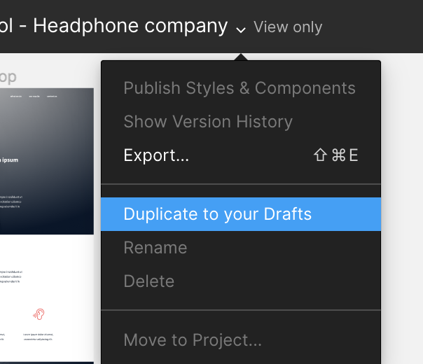

# Implement a design from scratch

| Concepts |
| --------- |
| For this project, we expect you to look at this concept: - [Implement a design](https://intranet.hbtn.io/concepts/963) |

In this project, you will implement from scratch, without any library, a web page. You will use all HTML/CSS/Accessibility/Responsive design knowledges that you learned previously.

You won’t have a lot of instruction, you are free to implement it the way that you want - the objective is simple: Have a fully functional web page that looks the same as the designer file.

Here the final result:

| Max | Medium | Small |
| --------- | --------- | --------- |
|  |  |  |

This webpage has been designed by Nicolas Philippot, UI/UX designer. You can find final screens [here](https://intranet-projects-files.s3.amazonaws.com/holbertonschool-webstack/622/Archive.zip)

## Requirements
- you are not allowed to import external CSS framework (like Bootstrap)
- you are not to use Javascript

Create an account in [Figma](https://intranet.hbtn.io/rltoken/y6_o1T-HtCyTAGuOJqdA_g) and open this [project](https://intranet.hbtn.io/rltoken/SpYRV14tPxTZJSjU2Eoh4A) and “Duplicate to your Drafts” to have access to all design details.

If you can’t access to it, please find here the [Figma file](https://intranet.hbtn.io/rltoken/tWEPFyHyXyNO9Xfi2Er2EA)

## Important notes with Figma:

if your computer doesn’t have missing fonts, you can find them here: [source-sans-pro](https://intranet.hbtn.io/rltoken/yvx4-XkjAQJgHlN6RAoKWQ) and [Spin-Cycle-OT](https://intranet.hbtn.io/rltoken/Jw0FKYKB6l5_2Koto0duTA)
some values are in float - feel free to round them
For this task, please write an amazing README.md

## Interactions note:

- the web page must switch to the mobile version when the screen width is 480px or less
- links hover/active: #FF6565
- button hover/active: opacity: 0.9
- max width of the content: 1000px centered in the page
